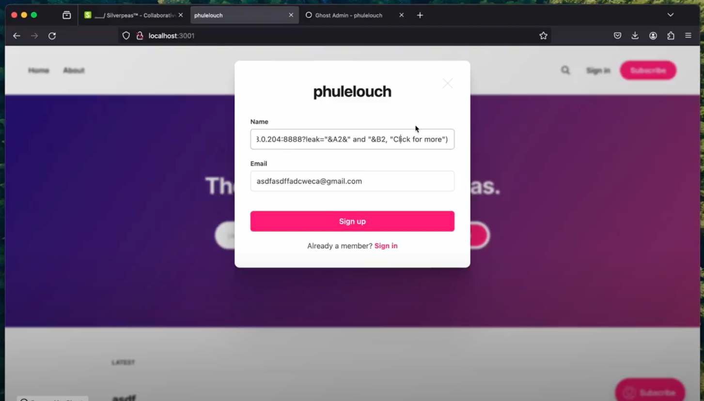

# CVE-2024-34448

VulnerabilityType: CSV Injection
Vendor of Product: GhostCMS (https://github.com/TryGhost/Ghost)
Version: < 5.82.0
Affected Component: CSV export
Attack Type: Remote
Impact Escalation of Privileges: true
Impact Information Disclosure: true

- It's possible for certain fields in a member CSV export to be executed by software that opens the CSVs
- One of it is register fields so unauthenticated users/attackers and input CSV injection payloads

- Video Poc:
https://drive.google.com/file/d/1oDbHuNDADhy2b6InxpqrkBDXYcTrboyi/view?usp=sharing

- commit to fix this: 
https://github.com/TryGhost/Ghost/commit/de668e7950a019a204b2df0c84596ea0fa32cce6.
https://github.com/TryGhost/Ghost/compare/v5.81.1...v5.82.0

